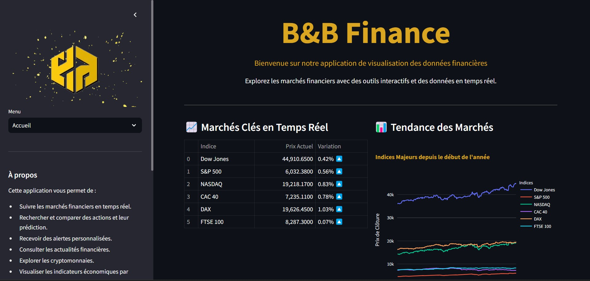
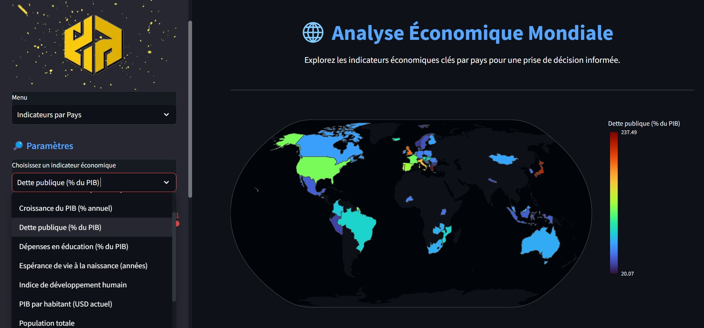
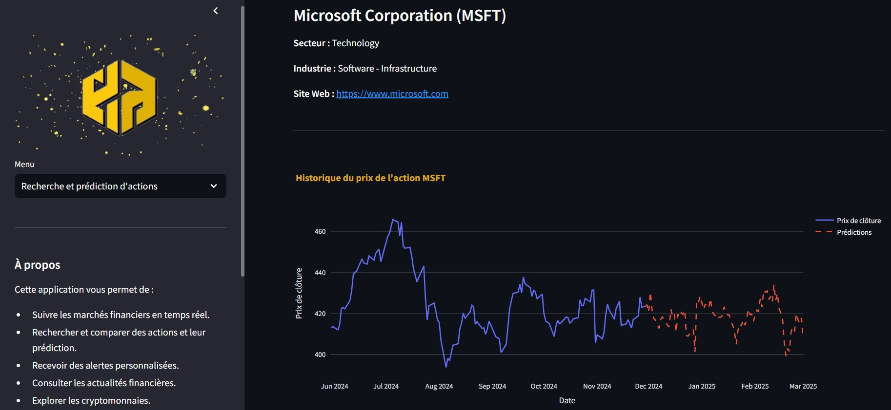

#  B&B Finance

Bienvenue dans **B&B Finance**, votre tableau de bord complet pour suivre les dernières actualités financières, analyser les tendances économiques mondiales, surveiller les cryptomonnaies et configurer des alertes personnalisées pour les actions qui vous intéressent.

Voici le lien du site : https://bbfinance.streamlit.app/

## 🌟 **Fonctionnalités Clés**

- **Actualités Financières** : Restez informé des dernières actualités économiques et financières du monde entier.
- **Prévisions Financières** : Affichez les prévisions de notre modèle pour l'action de votre choix.
- **Cryptomonnaies** : Suivez en temps réel les principales cryptomonnaies, comparez-les et analysez leurs tendances.
- **Analyse Économique Mondiale** : Explorez les indicateurs économiques clés par pays pour une prise de décision éclairée.
- **Alertes Personnalisées** : Configurez des alertes sur les actions pour recevoir des notifications lorsque certaines conditions sont remplies.



## 📂 **Structure du projet**

### **Fichiers du dossier principale**

- **app.py** : Permet de lancer l'application, il contient les informations de la sidebar, de l'acceuil et appels tous les onglets grâce aux fonctions des scritps dans le dossier **modules**
- **Description.ipynb** : Contient l'analyse effectuée sur nos données, pour mieux les comprendre, créé des graphiques et entrainer des modèles prédictifs.
- **requirements.txt** : Contient l'ensemble des packages nécessaires pour faire tourner l'application.
- **Présentation_du_Projet.pdf** : Présention du projet, de nos objectifs, des données et indicateurs que nous avons utilisés. Mais également des difficultées que nous avons rencontrées et des idées pour aller plus loin.

### **utils**
- **data_fetcher.py** : Contient une fonction pour calculer la variation en pourcentage d'une action. Il est appelé par **app.py** pour obtenir le graphique des indices et par **alertes_personnalisees.py**

### **modules**
- **actualites_financieres.py** : Appel l'API de NewsData.io pour rechercher les dernières actualitées concernant un certain sujet(Entreprises, Technologi, Science, Santé, Monde)
- **alertes_personnalisees.py** : Permet de créé une alerte lorsqu'une action passe un certain prix ou que son indice varie d'un certain pourcentage
- **comparaison_actions.py** : Après avoir choisit plusieurs actions provenant de la bibliothèque **yfinance**, affiche un tableau de performances des actions, des courbes pour comparer leur prix de clôture ou de télécharger les données historiques pour une analyse plus approfondie.
- **cryptomonnaies.py** : Récupère des informations sur les cryptommonaies à partir de l'API **COINGECKO** et affiche différents graphiques (Courbes, Heatmap, Graphe 3D, Tableau) pour les comparer
- **indicateurs_pays.py** : Récupère des informations de l'API **worldbank**. Des filtres dans la sidebar permettent ensuite de sélectionner, parmis une vingtaine, un indicateur clé (%dette ppublique, population, accès à l'éctrécité, ...)

- **marche_temps_reel.py** : Utilise **streamlit_autorefresh** pour rafrachir selon une période choisit en filtre par l'utilisateur les prix, variation des actions.
- **model.py** : On récupère les données historiques de l'action choisit dans **recherche_predict_actions.py** et entraine un modèle Light Gradient Boosting (choisit pour sa rapidité une fois l'application mis en cloud) et affiche les prédictions sur la période choisit par l'utilisateurs.
- **recherche_predict_actions.py** : On choisit une action et une période à afficher, ainsi que la période de prévisions à afficher.


### **assets**
Contient les images utilisées par l'application.

### **.streamlit**
Contient la seul clé d'API nécessaire pour faire tourner le projet pour récupèrer les donnéees de **NewsData.io**. C'est une très mauvaise pratique certe mais elle n'est lié à aucun compte avec informations bancaires qui permmetrait à une personne mal intentionnée de faire de la requête de masse. Elle permet l'utilisaiton direct de l'application, mais pour bien faire nous aurions du placer ce dossier dans le git ignore et indiquer comment créé sa propore clé d'API pour faire tourner le porjet. 


## 🚀 **Installation**

### **Prérequis**

- **Python 3.7 ou supérieur** : Assurez-vous d'avoir Python installé sur votre système.
- **pip** : L'outil pour installer les packages Python nécessaires aux bon fonctionnement de l'application.
- **Git** (facultatif) : Pour cloner le dépôt depuis GitHub.

### **Étapes d'installation**

1. **Cloner le dépôt ou télécharger les fichiers**

   - **Avec Git :**

     ```bash
     git clone https://github.com/mendhi/B-B-Finance/tree/finance_branch
     ```

   - **Sans Git :**

     Téléchargez le fichier ZIP depuis GitHub et extrayez-le dans le répertoire de votre choix.

2. **Naviguer dans le répertoire du projet**

   ```bash
   cd application_financiere

3. **Utilisation**

📝 Utilisation

Lancer l’application

Exécutez la commande suivante à la racine du projet :

'''streamlit run app.py
